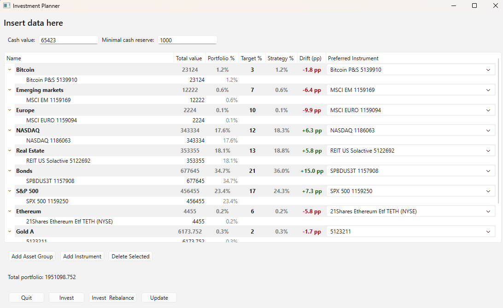
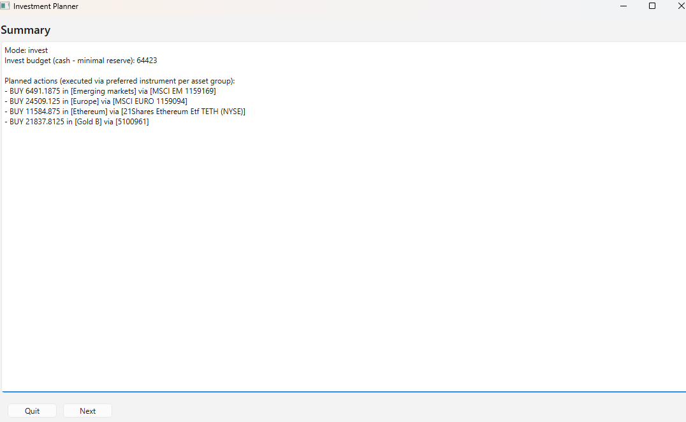

# Investment Planner

**A GUI tool for planning and executing a passive investment strategy**

`investment-planner` is a desktop application for managing a long-term investment strategy based on predefined asset allocation targets.

It helps answer a common question for passive investors:

> *Given my current holdings and target allocation, how should I allocate new money (or rebalance) in a clear, controlled way?*

The tool is designed for real-world use, emphasizes correctness and transparency, and is actively used to manage an actual portfolio.

---

## Core concepts

- You define asset groups with target percentages (must sum to exactly 100).
- Instruments belong to groups and have a current market value (ILS).
- Over time, market movements cause the portfolio to drift from the target.
- When investing new money (or rebalancing), the app:
  - shows how far each group is from its target
  - calculates how much should be allocated per group
  - helps translate value allocations into concrete buy decisions

The application never executes trades automatically. All actions are explicit and user-controlled.

---

## Features

### Portfolio structure
- Asset groups with decimal target percentages
- Instruments with current market value in ILS
- Required per-instrument `ticker` field
  - `TASE`: exactly 7 digits
  - `NYSE`: exactly 4 uppercase letters or digits
- Required per-instrument `quantity` field (non-negative integer)
- Per-instrument `exchange` (`TASE` or `NYSE`) for wizard price-entry semantics
  - `TASE` prices are treated as ILS (agorot entry in wizard)
  - `NYSE` prices are treated as USD (USD entry + USD/ILS conversion in wizard)
- Per-group instrument split using mandatory in-group target percentages (must sum to 100 per group)
- Permanent non-investable bucket for holdings excluded from the strategy
- Cash with:
  - configurable minimum reserve
  - configurable future tax (non-investable liability)

### Calculations and insights
- Strategy % per group (share of investable assets)
- Portfolio % per row (share of total portfolio value), where:
  - `total portfolio = cash + all instrument values - future tax`
- Drift (pp) from target allocation, with color coding:
  - green -> over target
  - red -> under target
- Strict validation: target percentages must sum to `100.0` exactly
- Future tax must be non-negative (empty input is normalized to `0`)

### Investment workflow
- Two modes:
  - Invest: allocate new funds without selling
  - Invest & Rebalance: allow selling to restore targets
- Invest budget formula:
  - `cash - minimal reserve - future tax` (floored at zero)
- Step-by-step investment flow:
  - per-instrument allocation based on your target portfolio mix
  - wizard step info shows instrument name, ticker, exchange, asset group, and action amount
  - enter instrument price and calculate how many units to buy/sell
  - USD-priced steps use a USD/ILS rate prepared during startup
  - calculation can be triggered by button click, pressing `Enter`, or leaving the price field
  - unit amounts are rounded down to whole numbers
- Wizard actions:
  - `Save and continue` applies the current step and moves forward
  - `Save and continue` is enabled only after a valid calculation
  - `Skip Step` moves on without applying the current step
  - `Exit Wizard` returns to the portfolio screen without applying the current step
  - `Quit` exits the app
  - if a sell step asks for more units than available, the app shows a clear error and skips that step
- Partial execution supported (each instrument handled independently)

### UI and UX
- Startup welcome screen with:
  - `Open Last Portfolio` (shows remembered path)
  - remembered path appears directly under `Open Last Portfolio` (truncated in-label, full path in tooltip)
  - `Load Portfolio...`
  - `Start New File`
  - `Quit`
  - after choosing a startup action that opens the main editor, a brief blocking transition overlay appears while startup tasks complete
  - if the USD/ILS rate is unavailable, the app keeps you on the welcome screen so you can retry
- Immediate validation with clear feedback for quantity/target percent edits
- Future tax is highlighted in red when greater than zero
- Main screen shows your live investable balance, with color feedback:
  - green when you have enough to invest
  - gray when you do not
- Main editor includes:
  - `Ticker` column (instrument rows), required and exchange-validated on save/planning actions
  - ticker input accepts letters/digits only while typing; lowercase is normalized to uppercase on commit
  - `Quantity` column (instrument rows), required non-negative integer
  - empty quantity input is normalized immediately to `0`
  - `Exchange` column (instrument rows) with dropdown editing (`TASE`, `NYSE`)
- Wizard displays all planned/spent/proceeds/leftover amounts explicitly in ILS
- Drag and drop to:
  - reorder groups and instruments
  - move instruments into or out of the non-investable bucket

For internal code structure and test architecture, see
[`docs/ARCHITECTURE.md`](docs/ARCHITECTURE.md).

---

## Screenshots

### Main portfolio screen



### Investment summary screen



### Per-instrument investment screen


---

## Running the application

### Requirements
- Python 3.13+
- PySide6

Install dependencies:

```bash
pip install PySide6
```

Run the app:

```bash
python investment_planner.py
```

---

## Data file format

The app reads and writes a JSON portfolio file. The canonical schema/example is
maintained in [`example_portfolio.json`](example_portfolio.json).

Notes:
- Monetary/percentage values are stored as strings and parsed as decimals.
- `instruments[*].exchange` is required and must be `TASE` or `NYSE`.
- `instruments[*].ticker` is required.
  - `TASE` tickers must be exactly 7 digits.
  - `NYSE` tickers must be exactly 4 uppercase letters or digits.
- `instruments[*].quantity` is required and must be a non-negative integer.
- `groups[*].targetPercentage` must sum to exactly `100`.
- For each investable group, `targetInGroupPercentage` across its instruments must sum to exactly `100`.
- Non-investable instruments must not have `groupId`, and their `targetInGroupPercentage` must be `0`.
- JSON files with or without UTF-8 BOM are supported on load.

---

## Saving your work

- The app remembers the last portfolio file you worked on and shows it on startup.
- Startup always opens a welcome screen where you can choose to:
  - open the remembered portfolio
  - load a different file
  - start a new default portfolio
  - quit
- If no remembered path exists yet, `Open Last Portfolio` is disabled and shows `No recent portfolio`.
- If the remembered file is missing, the welcome screen marks it as `Not found` and disables direct open.
- The app reuses the latest successful USD/ILS quote across wizard runs in the current app session.
- `Save` updates the current file.
- `Save As` lets you choose a new file name/location.
- `Open` loads an existing portfolio file.
- `New` starts a fresh default portfolio.
- If you try to `Open`, `New`, or `Quit` with unsaved changes, the app asks whether to save first.
- In the step-by-step wizard:
  - `Save and continue` writes progress after that step.
  - `Skip Step` moves on without writing that step.
  - `Exit Wizard` returns to the portfolio screen without applying the active step.

---

## Project metadata

- Name: `investment-planner`
- Version source: `pyproject.toml` (`[project].version`)
- Type: Desktop GUI application (PySide6)
- Primary language: Python
- Python requirement: `>=3.13`
- License: MIT (see [`LICENSE`](LICENSE))
